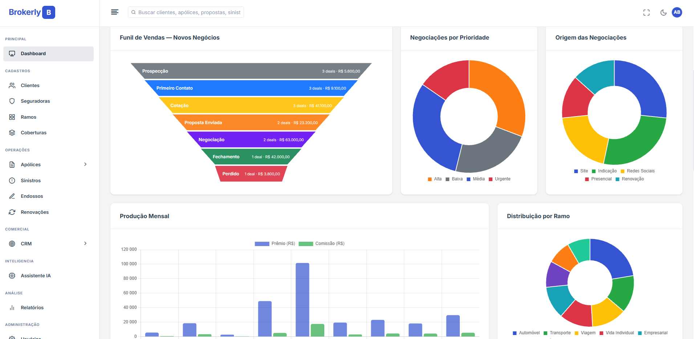
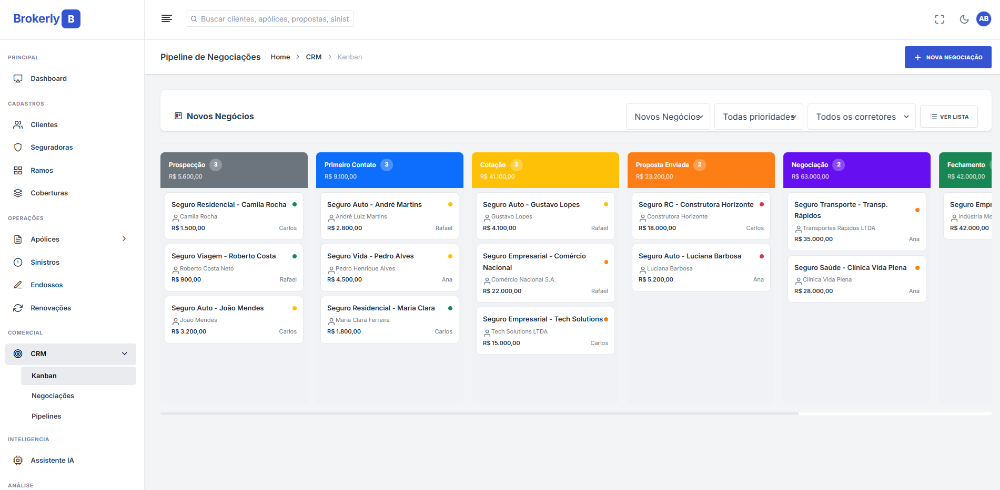
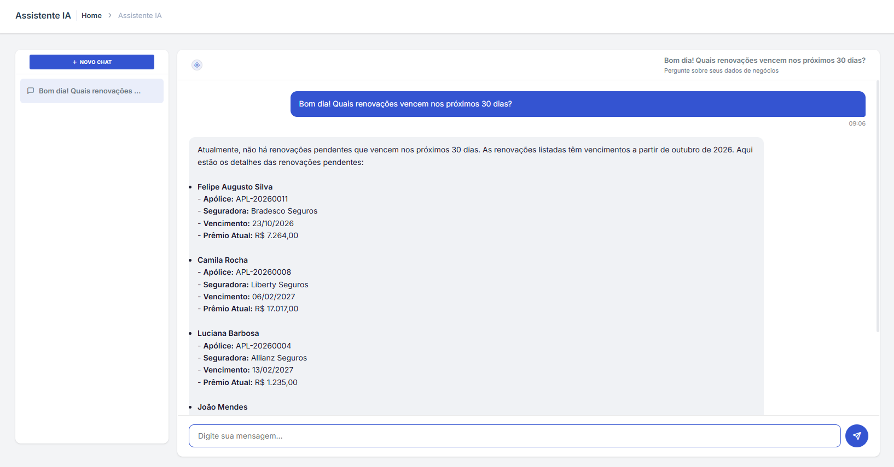
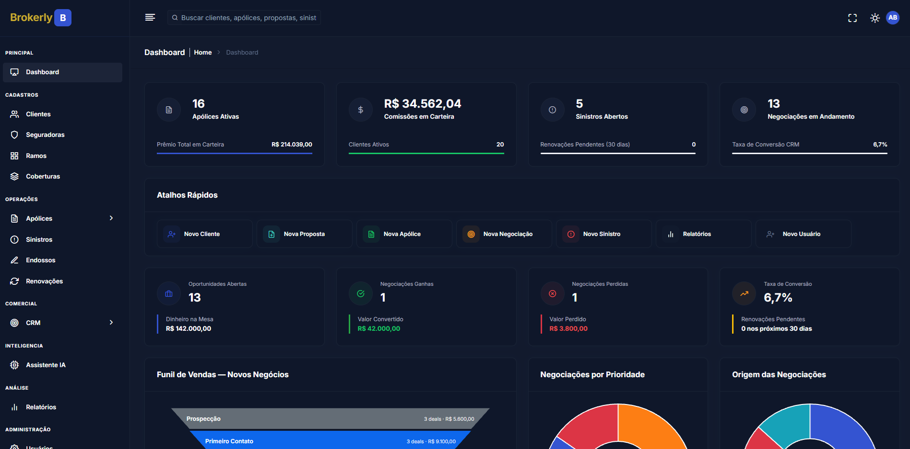

# Brokerly: Sistema de Corretora de Seguros

> English version available at [README.md](README.md).

Projeto de portfólio que apresenta um sistema completo de gestão para corretoras de seguros, desenvolvido em Django. Abrange desde o cadastro de clientes e seguradoras até o CRM de vendas, controle de sinistros, renovações, endossos, relatórios gerenciais e recursos de IA.

---

## 📸 Screenshots


*Dashboard do admin: funil de vendas, KPIs, produção mensal e distribuição da carteira.*

| CRM Kanban | Assistente IA |
|:----------:|:-------------:|
|  |  |
| Pipeline de vendas com drag-and-drop e totalização por etapa. | Consultas em linguagem natural sobre seus próprios dados. |

| Relatórios | Modo Escuro |
|:----------:|:-----------:|
|  |  |
| Relatórios com filtros e exportação em CSV e PDF. | Tema escuro disponível em toda a aplicação. |

---

## 📋 Índice

- [Funcionalidades](#-funcionalidades)
- [Tecnologias](#-tecnologias)
- [Estrutura do Projeto](#-estrutura-do-projeto)
- [Instalação e Execução Local](#-instalação-e-execução-local)
- [Papéis e Permissões](#-papéis-e-permissões)
- [Agente de IA](#-agente-de-ia)

---

## ✨ Funcionalidades

### Cadastros
- **Clientes**: Pessoas Físicas e Jurídicas com dados completos (endereço, contato, documentos)
- **Seguradoras**: Cadastro com código SUSEP, ramos e contatos
- **Coberturas**: Tipos de seguro, coberturas e itens de cobertura

### Operações
- **Propostas**: Ciclo completo: rascunho → enviada → em análise → aprovada/recusada
- **Apólices**: Gestão de vigência, prêmios, parcelas, comissões e documentos
- **Sinistros**: Abertura, acompanhamento, timeline de eventos e documentação
- **Endossos**: Inclusão, exclusão, alteração, cancelamento e transferência
- **Renovações**: Controle de vencimentos com alertas de urgência e atraso

### Comercial
- **CRM / Kanban**: Pipeline visual com drag-and-drop (SortableJS), filtros por prioridade e corretor
- **Negociações**: CRUD completo com atividades (notas, ligações, emails, reuniões, tarefas)
- **Pipelines**: Gestão de etapas customizáveis com cores e marcação de ganho/perda

### Análise
- **Dashboard**: KPIs, gráficos de produção mensal, distribuição por tipo/seguradora, sinistros
- **Relatórios**: 10 relatórios com filtros, exportação CSV e PDF:
  - Produção por Período
  - Comissões por Corretor
  - Carteira por Seguradora
  - Carteira por Tipo de Seguro
  - Sinistros por Período
  - Sinistralidade (Loss Ratio)
  - Renovações Pendentes
  - Clientes por Corretor
  - Funil CRM
  - Endossos por Período

### Administração
- **Usuários**: CRUD com papéis (Admin, Gerente, Corretor)
- **Perfil**: Edição de dados pessoais e troca de senha

### UI/UX
- Tema DuralUX com design system completo
- Modo Dark/Light com toggle
- Sidebar com navegação ativa e permissões por papel
- Tabelas responsivas, filtros e busca em todas as listas
- Badges de status com cores semânticas

### Agente de IA
- Assistente conversacional para consultar carteira, negociações, sinistros e renovações
- Insights automáticos no dashboard por papel de usuário
- Resumos de clientes, negociações, apólices, propostas e sinistros
- Implementado com LangChain, LangGraph e controle de acesso por papel

---

## 🛠️ Tecnologias

| Camada | Tecnologia |
|--------|-----------|
| Backend | Python 3.12+ / Django 6.0 |
| Banco de Dados | SQLite (dev) |
| Frontend | Bootstrap 5 / DuralUX Template |
| Gráficos | Chart.js 4 |
| Drag & Drop | SortableJS |
| PDF Export | xhtml2pdf |
| Form Rendering | django-widget-tweaks |
| Imagens | Pillow |
| IA / LLM | LangChain, LangGraph, OpenAI |

---

## 📁 Estrutura do Projeto

```
brokerly/
├── accounts/          # Autenticação, usuários e perfis
├── ai_agent/          # Assistente de IA, insights e resumos
├── claims/            # Sinistros e documentos
├── clients/           # Clientes (PF/PJ)
├── core/              # Settings, URLs raiz, WSGI
├── coverages/         # Tipos de seguro e coberturas
├── crm/               # Pipeline, negociações (deals) e atividades
├── dashboard/         # Dashboard com KPIs e gráficos
├── design_system/     # Documentação do design system
├── endorsements/      # Endossos
├── insurers/          # Seguradoras e ramos
├── policies/          # Propostas e apólices
├── renewals/          # Renovações
├── reports/           # Relatórios gerenciais (10 tipos)
├── static/            # CSS, JS, imagens, fontes
├── templates/         # Templates Django (base, partials, por app)
├── utils/             # Mixins, validators, template tags, management commands
├── manage.py
├── requirements.txt
└── README.md
```

---

## 🚀 Instalação e Execução Local

Requer Python 3.12+.

```bash
git clone https://github.com/yagosamu/brokerly.git
cd brokerly
python -m venv .venv && source .venv/bin/activate   # Windows: .venv\Scripts\activate
pip install -r requirements.txt
cp .env.example .env                                 # opcional: defina OPENAI_API_KEY para usar a IA
python manage.py migrate
python manage.py seed_demo                           # ~20 clientes, 20 apólices, 15 deals, sinistros, renovações
python manage.py runserver
```

Acesse `http://localhost:8000` e entre com um dos usuários criados pelo seed:

| Papel    | Email                  | Senha          |
|----------|------------------------|----------------|
| Admin    | `admin@brokerly.com`   | `admin123`     |
| Gerente  | `gerente@brokerly.com` | `gerente123`   |
| Corretor | `carlos@brokerly.com`  | `corretor123`  |

Entre como **Admin** para acesso total e depois como **Corretor** para ver o filtro de permissões em ação.

---

## 🔒 Papéis e Permissões

O sistema possui 3 papéis com níveis de acesso distintos:

### Admin
- ✅ Acesso total a todas as funcionalidades
- ✅ Gestão de usuários
- ✅ Todos os relatórios
- ✅ Gestão de pipelines CRM
- ✅ Visualiza dados de todos os corretores

### Gerente (Manager)
- ✅ Acesso a todas as funcionalidades operacionais
- ✅ Gestão de usuários
- ✅ Todos os relatórios
- ✅ Gestão de pipelines CRM
- ✅ Visualiza dados de todos os corretores

### Corretor (Broker)
- ✅ Cadastro e gestão de clientes (apenas os seus)
- ✅ Propostas, apólices, sinistros, endossos e renovações (apenas os seus)
- ✅ CRM Kanban e negociações (apenas as suas)
- ❌ **Sem acesso** a relatórios gerenciais
- ❌ **Sem acesso** a gestão de pipelines
- ❌ **Sem acesso** a gestão de usuários

---

## 🤖 Agente de IA

O agente de IA usa LangChain e LangGraph para oferecer chat, insights de dashboard e resumos de entidades. Ele respeita as permissões do usuário logado: corretores consultam apenas seus próprios dados, enquanto admins e gerentes acessam a visão completa.

Configure `OPENAI_API_KEY` e `OPENAI_MODEL` no `.env` para habilitar os recursos de IA. Sem essas variáveis, o restante do sistema continua funcionando normalmente.

---

## 📄 Licença

Projeto criado para fins de portfólio e demonstração técnica.
